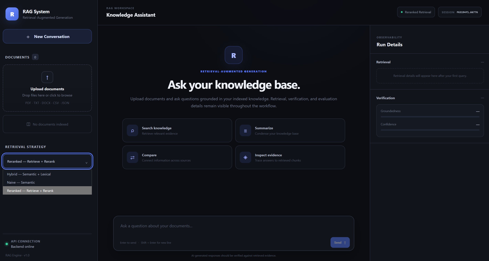
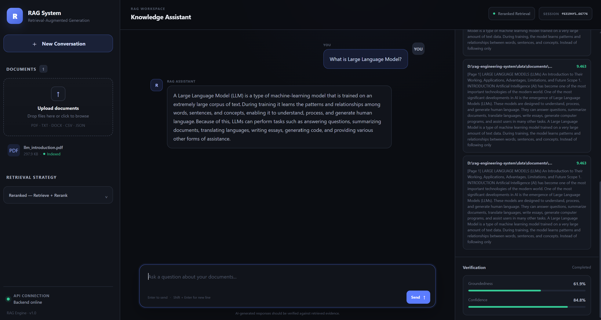
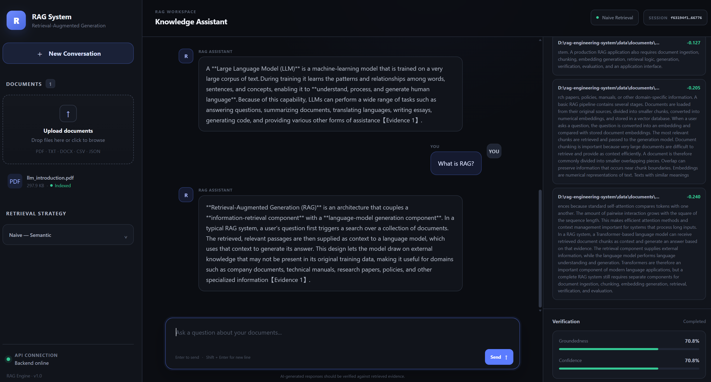

# RAG Engineering System

<div align="center">

**A production-oriented Retrieval-Augmented Generation (RAG) system for conversational document intelligence**

Combining multiple retrieval strategies, reranking, session memory, groundedness verification, confidence estimation, and retrieval evaluation in a modular FastAPI architecture.


> **Status:** Working locally · Tested · Benchmarked
> **Repository:** `codebyj857/rag-engineering-system`

</div>

---

## 📑 Table of Contents

- [Overview](#-overview)
- [Application](#-application)
- [Key Features](#-key-features)
- [Retrieval Experiment](#-retrieval-experiment)
- [System Architecture](#-system-architecture)
- [Project Structure](#-project-structure)
- [Technology Stack](#-technology-stack)
- [Request Flow](#-request-flow)
- [Evaluation Methodology](#-evaluation-methodology)
- [Running Locally](#-running-locally)
- [Running Tests](#-running-tests)
- [Running the Retrieval Experiment](#-running-the-retrieval-experiment)
- [Design Decisions](#-design-decisions)
- [Security Considerations](#-security-considerations)
- [Limitations](#-limitations)
- [Future Improvements](#-future-improvements)
- [What This Project Demonstrates](#-what-this-project-demonstrates)
- [Author](#-author)
- [License](#-license)

---

## 🚀 Overview

This project explores how retrieval quality affects the reliability of a conversational RAG system.

Instead of relying on a single vector-search pipeline, the system supports multiple retrieval strategies:

* **Naive retrieval**
* **Hybrid retrieval**
* **Reranked retrieval**

The retrieved evidence is passed into a generation pipeline with conversational session memory. Generated responses are then evaluated using groundedness verification and confidence estimation.

The project also includes a retrieval evaluation framework for comparing strategies using measurable retrieval-quality and efficiency metrics.

---

## 🖥️ Application

The system provides a browser-based interface for conversational document analysis.

### Main Interface



### LLM Response



### RAG Response 



> Screenshots show the application running locally during development and testing.

---

## ✨ Key Features

### 🔎 Multi-Strategy Retrieval

The system supports three retrieval approaches:

| Strategy | Description |
| -------- | ----------- |
| **Naive**    | Baseline semantic/vector retrieval |
| **Hybrid**   | Combines complementary retrieval signals |
| **Reranked** | Retrieves candidates and reorders them using a reranking stage |

This makes it possible to evaluate how retrieval strategy affects downstream answer quality.

### 🧠 Conversational Memory

The system maintains session-level conversation history and uses a query contextualization layer to improve follow-up questions.

Example:

```text
User: What is a vector database?

User: Why is it useful here?
```

The contextualizer can use the previous conversation to interpret the second question in context.

### 🛡️ Groundedness Verification

Generated answers are checked against retrieved evidence.

The response exposes verification information through the API and frontend, allowing users to inspect whether the generated answer is supported by the retrieved context.

### 📊 Confidence Estimation

The system combines multiple signals to estimate response confidence, including:

* Retrieval quality
* Groundedness
* Evidence quality

This provides an additional signal beyond the generated answer itself.

### 🧪 Retrieval Evaluation

The project includes a benchmark framework for comparing retrieval strategies without requiring additional LLM calls.

Evaluation covers:

* Document precision
* Document recall
* Document F1
* Document hit rate
* Chunk precision
* Chunk recall
* Chunk F1
* Chunk hit rate
* Mean Reciprocal Rank (MRR)
* Retrieval latency
* Relevant-chunk rank movement

---

## 📈 Retrieval Experiment

A fixed evaluation dataset containing **12 questions** was used to compare the retrieval strategies.

The evaluation produced **36 retrieval runs** across the three strategies.

### Reranked Retrieval Results

The reranked pipeline achieved the following results on the evaluation corpus:

| Metric | Result |
| ------ | ------ |
| Chunk Recall@5 | **95.83%** |
| Chunk Hit@5 | **100%** |
| MRR | **0.9444** |
| Mean relevant-chunk rank movement | **+0.50** |

> These results are specific to the project's evaluation corpus and benchmark dataset.

### Interpretation

The experiment demonstrates that reranking can improve the ordering of relevant chunks after initial retrieval.

In particular, the reranked pipeline achieved:

* Very high relevant-chunk recall
* A relevant chunk appearing in every evaluated top-5 result
* High reciprocal-rank performance
* Positive movement of relevant chunks toward higher-ranked positions

The benchmark also measures latency because retrieval quality and computational cost need to be considered together.

Detailed evaluation outputs are available in:

```text
docs/evaluation/retrieval_results.csv
docs/evaluation/retrieval_results.md
```

---

## 🏗️ System Architecture

```text
                         ┌──────────────────────┐
                         │      Frontend        │
                         │   HTML / CSS / JS    │
                         └──────────┬───────────┘
                                    │
                                    ▼
                         ┌──────────────────────┐
                         │       FastAPI        │
                         │      REST API        │
                         └──────────┬───────────┘
                                    │
                    ┌───────────────┼────────────────┐
                    │               │                │
                    ▼               ▼                ▼
              ┌──────────┐   ┌────────────┐   ┌─────────────┐
              │  Session │   │ Retrieval  │   │ Evaluation  │
              │  Memory  │   │  Pipeline  │   │  Framework  │
              └────┬─────┘   └──────┬─────┘   └─────────────┘
                   │                 │
                   │        ┌────────┼────────┐
                   │        │        │        │
                   │        ▼        ▼        ▼
                   │      Naive    Hybrid  Reranked
                   │
                   └──────────────┬──────────────┐
                                  │              │
                                  ▼              ▼
                           ┌────────────┐  ┌──────────────┐
                           │ Generation │  │ Verification │
                           │   Layer    │  │ + Confidence │
                           └─────┬──────┘  └──────┬───────┘
                                 │                │
                                 └───────┬────────┘
                                         ▼
                                  Final Response
```

---

## 📁 Project Structure

```text
rag-engineering-system/
│
├── frontend/
│   ├── index.html
│   ├── css/
│   │   └── style.css
│   ├── js/
│   │   ├── api.js
│   │   ├── ui.js
│   │   └── app.js
│   └── assets/
│
├── src/
│   └── rag_engine/
│       ├── main.py
│       ├── config.py
│       │
│       ├── api/
│       │   ├── dependencies.py
│       │   └── routes/
│       │       ├── health.py
│       │       ├── ingest.py
│       │       ├── chat.py
│       │       ├── sessions.py
│       │       ├── retrieve.py
│       │       └── evaluate.py
│       │
│       ├── ingestion/
│       │   ├── loader.py
│       │   └── chunker.py
│       │
│       ├── indexing/
│       │   ├── embeddings.py
│       │   └── vector_store.py
│       │
│       ├── retrieval/
│       │   ├── base.py
│       │   ├── naive.py
│       │   ├── hybrid.py
│       │   └── reranker.py
│       │
│       ├── memory/
│       │   ├── session_store.py
│       │   └── query_contextualizer.py
│       │
│       ├── generation/
│       │   └── generator.py
│       │
│       ├── verification/
│       │   ├── groundedness.py
│       │   └── confidence.py
│       │
│       ├── pipelines/
│       │   ├── base.py
│       │   ├── naive.py
│       │   ├── hybrid.py
│       │   └── reranked.py
│       │
│       └── evaluation/
│           ├── dataset.py
│           ├── evaluator.py
│           ├── results.py
│           └── metrics/
│
├── data/
│   ├── documents/
│   └── evaluation/
│
├── docs/
│   ├── evaluation/
│   ├── figures/
│   └── screenshots/
│       ├── rag-app.png
│       ├── rag-response-llm.png
│       └── rag-response-rag.png
│
├── tests/
│   ├── unit/
│   ├── integration/
│   └── evaluation/
│
├── scripts/
│   ├── index_documents.py
│   ├── run_retrieval_experiment.py
│   ├── run_evaluation.py
│   └── inspect_chunks.py
│
├── Dockerfile
├── docker-compose.yml
├── pyproject.toml
├── uv.lock
├── .env.example
└── README.md
```

---

## 🛠️ Technology Stack

| Layer | Technologies |
| ----- | ------------ |
| **Backend** | Python 3.11 · FastAPI · Pydantic · Uvicorn |
| **Retrieval & NLP** | Sentence Transformers · Vector search · Hybrid retrieval · Reranking · Transformers |
| **LLM** | Groq API · Configurable LLM model |
| **Storage** | ChromaDB · Local document storage |
| **Frontend** | HTML · CSS · Vanilla JavaScript |
| **Testing & Evaluation** | Pytest · Custom retrieval evaluation framework · Retrieval metrics · Matplotlib-based evaluation plots |
| **Development** | `uv` · Git · GitHub · Docker / Docker Compose configuration |

---

## 🔄 Request Flow

A typical chat request follows this pipeline:

```text
User Query
    │
    ▼
Session Memory
    │
    ▼
Query Contextualization
    │
    ▼
Retrieval Strategy
    │
    ├── Naive
    ├── Hybrid
    └── Reranked
    │
    ▼
Relevant Evidence
    │
    ▼
LLM Generation
    │
    ▼
Groundedness Verification
    │
    ▼
Confidence Estimation
    │
    ▼
Final Response
```

---

## 🔬 Evaluation Methodology

The retrieval experiment evaluates retrieval independently from LLM generation.

This is intentional because it allows retrieval strategies to be compared without repeatedly consuming LLM API quota.

For every evaluation question, the system measures whether the expected document and relevant chunks were retrieved.

The benchmark therefore separates:

```text
Retrieval Quality
        ↓
Evidence Selection
        ↓
Generation
        ↓
Verification
```

This makes it easier to identify whether a poor response originates from retrieval or downstream generation.

---

## ⚡ Running Locally

### 1. Clone the repository

```bash
git clone https://github.com/codebyj857/rag-engineering-system.git
cd rag-engineering-system
```

### 2. Install dependencies

This project uses [`uv`](https://github.com/astral-sh/uv).

```bash
uv sync
```

### 3. Configure environment variables

Create a `.env` file based on `.env.example`.

```env
GROQ_API_KEY=your_api_key_here

ENVIRONMENT=development
DEBUG=true

API_HOST=127.0.0.1
API_PORT=8000
FRONTEND_URL=http://127.0.0.1:5500

LLM_MODEL=openai/gpt-oss-120b
LLM_TEMPERATURE=0.2

DEFAULT_RETRIEVAL_STRATEGY=reranked
DEFAULT_TOP_K=5

CHUNK_SIZE=800
CHUNK_OVERLAP=120
```

> ⚠️ **Never commit `.env` or expose API credentials.**

### 4. Start the backend

```bash
uv run uvicorn rag_engine.main:app --reload
```

The API will be available at:

```text
http://127.0.0.1:8000
```

Interactive API documentation:

```text
http://127.0.0.1:8000/docs
```

### 5. Start the frontend

In a second terminal:

```bash
cd frontend
python -m http.server 5500
```

Open:

```text
http://127.0.0.1:5500
```

---

## ✅ Running Tests

Run the complete test suite with:

```bash
uv run pytest
```

The project includes:

* Unit tests
* API/integration tests
* Retrieval evaluation tests

---

## 🧪 Running the Retrieval Experiment

The retrieval benchmark can be executed without making additional LLM calls.

```bash
uv run python scripts/run_retrieval_experiment.py
```

Evaluation artifacts are stored under:

```text
docs/evaluation/
data/evaluation/runs/
```

---

## 🧩 Design Decisions

### Why multiple retrieval strategies?

A single retrieval method does not always perform consistently across different queries.

Supporting multiple strategies makes the system measurable and allows retrieval quality to be compared experimentally.

### Why reranking?

Initial retrieval can return semantically related but poorly ordered results.

A reranking stage provides another opportunity to move highly relevant evidence toward the top of the context supplied to the generator.

### Why verification?

A fluent answer is not necessarily a grounded answer.

The verification layer provides an additional signal based on the relationship between the generated response and retrieved evidence.

### Why evaluate retrieval separately?

RAG quality depends heavily on retrieval.

Separating retrieval evaluation from LLM generation makes it possible to identify retrieval failures without conflating them with generation behavior.

---

## 🔐 Security Considerations

The project keeps secrets outside source control.

Sensitive configuration such as:

```text
GROQ_API_KEY
```

is loaded from environment variables and excluded through `.gitignore`.

The repository does not contain the actual API key.

---

## ⚠️ Limitations

This project is an engineering and evaluation system rather than a production-scale cloud deployment.

Current limitations include:

* Local document storage
* Local vector database
* Session state maintained by the application
* Evaluation corpus is limited in size
* Retrieval metrics are corpus-specific
* LLM output quality depends on the selected model and available context
* Local execution is required for the current demo

The reported benchmark results should therefore be interpreted as measurements on the included evaluation dataset rather than universal performance claims.

---

## 🗺️ Future Improvements

Potential extensions include:

* Persistent production database
* Distributed vector storage
* Larger evaluation datasets
* Automated regression evaluation
* Advanced query rewriting
* Multi-document citation tracking
* Streaming responses
* Authentication and authorization
* Observability and tracing
* Automated evaluation dashboards
* Cloud deployment

---

## 🎯 What This Project Demonstrates

This project was designed to demonstrate practical understanding of an end-to-end RAG engineering workflow rather than simply calling an LLM API.

It covers:

```text
Document ingestion
       ↓
Chunking
       ↓
Embedding / indexing
       ↓
Retrieval
       ↓
Hybrid retrieval
       ↓
Reranking
       ↓
Conversational memory
       ↓
LLM generation
       ↓
Groundedness verification
       ↓
Confidence estimation
       ↓
Retrieval evaluation
       ↓
Automated testing
```

The emphasis is on **measurable retrieval behavior, modular architecture, evaluation, and reliability signals**.

---

## 👤 Author

**Joya Parveen**

B.Tech Computer Science & Engineering (Data Science)

Interested in:

* AI Engineering
* Retrieval-Augmented Generation
* LLM Applications
* Machine Learning
* AI Systems
* Applied Generative AI

---

## 📄 License

This project is intended for educational, portfolio, and research purposes.

---